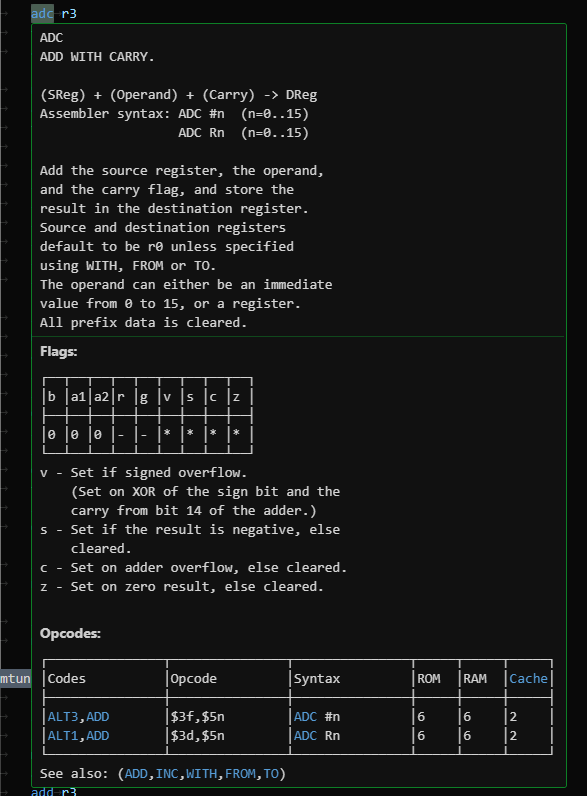

# 65816, Super FX Assembly (Argonaut Syntax) support + Argonaut Assembler Family directives

This Visual Studio Code extension adds 65816 and Super FX Assembly (Argonaut Syntax) support, with additional support for the directives used by Argonaut's SASM and ARGSFX assembler family.  
It also adds tooltips for Super FX instructions, based on the BRIEF editor macro Argonaut Software originally used.  

Extended from [my Super FX tooltip extension](https://github.com/Sunlitspace542/superfxhelp-vscode).

When a valid Super FX instruction with tooltip information present is hovered over, it shows a tooltip box with info about the current instruction.  
Note that instruction cycle counts mentioned are cycles from cache, not RAM or ROM.  

This extension is currently only compatible with Argonaut's SASM and ARGSFX assemblers.  
I want to add support for Randal Linden's xAsm assembler in the future, though I may just fork this extension and make that its own thing.  

## Compiling

Node.js, Git, Python 3, and obviously Visual Studio Code itself must be installed for this to compile.  
I don't know why Git is required, but it is.  
Open a PowerShell terminal window in the root of the repo and run ``npm install`` and ``npm install -g @vscode/vsce`` to setup all the dependencies.  
Run ``npm run compile`` to compile.  
Run ``vsce package`` to build a VSIX file that can be installed.  
Alternatively on Windows, use ``getmodules.cmd`` to install dependecies, use ``build.cmd`` to compile, and use ``package.cmd`` to make the VSIX file.  

To rebuild the Super FX help JSON, go to ``src\data\`` and run ``python3 makejson.py``.  

## TODO

- [ ] Super FX tooltips: See if the "see also" instructions bit at the end can be made into hyperlinks to those instructions' explanations, or if a sort of interactive help directory thing can be added
- [x] Super FX tooltips: Add RAM and ROM cycle counts for every instruction (will take a long time)
- [x] Super FX tooltips: Add explanations for branch instructions (left out of the original)